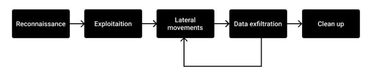
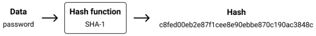

# 第一章 介绍

"任何足够先进的网络攻击都与魔法无异" —— 佚名

无论是在电影中还是在主流媒体中，黑客经常被浪漫化：他们被描绘成黑魔法巫师、恶毒的罪犯，或者在最坏的情况下，被描绘成戴着兜帽拿着撬棍的小偷。

实际上，攻击者的档案范围极其广泛，从无聊的青少年在互联网上探索，到主权国家的军队，以及不满的前员工。正如我们将看到的，网络攻击并不那么困难。知识只是分布不均，并被现有参与者嫉妒地保守秘密。主要成分是大量的好奇心和跟随直觉的勇气。

随着数字化在我们生活中占据越来越重要的地位，网络攻击的影响和规模也将以同样的方式增加：在当前的COVID-19大流行期间，我们无助地目睹了对我们医院的攻击，这些攻击产生了现实生活中的戏剧性后果。

是时候反击了，为今天（而不是明天）的战争和战斗做好准备，并理解为了防御，除了站在攻击者的角度思考他们的想法之外，别无他法。他们的动机是什么？他们如何能够如此轻易地闯入任何系统？他们对受害者做了什么？从理论到实践，我们将探索进攻性安全的奥秘，并使用Rust编程语言构建我们自己的进攻性工具。

## 为什么选择Rust？

安全世界（更广泛地说，软件世界）被太多带有太多陷阱的编程语言所困扰。你必须在快速但不安全（C、C++...）或缓慢但大多安全（Python、Java...）之间做出选择。

有人能成为所有这些语言的专家吗？我不这么认为。进攻性工具中无数的错误和漏洞证明了我是对的。

如果相反，我们可以有一种独特的语言会怎样。

一种一旦掌握，就能满足该领域所有需求的语言：

• Shellcode
• 跨平台远程访问工具（RAT）
• 可重用和可嵌入的漏洞利用
• 扫描器
• 钓鱼工具包
• 嵌入式编程
• Web服务器
• ...

如果我们有一种既足够底层又提供高级抽象、异常快速且易于交叉编译的单一语言会怎样。所有这些都在内存安全、高度可重用和极其可靠的同时实现。

不再有奇怪的工具链、奇怪的二进制打包器、易受攻击的网络代码、可注入的钓鱼表单...

你明白了，Rust就是统治一切的语言。

由于惯性，Rust还没有被安全行业广泛采用，但一旦技术负责人和独立黑客理解这个现实，我相信变化会发生得非常快。

当然，有一些陷阱和一些需要了解的事情，但在接下来的章节中都会涵盖。

## 1.1 攻击类型

并非所有攻击都是非法或未经请求的。让我们从野外发现的最常见攻击类型的快速总结开始。

### 1.1.1 没有明确目标的攻击

青少年有大量的空闲时间。因此，他们中的一些人可能会在放学后开始学习计算机安全，并攻击互联网上的随机目标。即使他们除了膨胀自己的自我和满足好奇心之外可能没有明确的目标，这些类型的攻击仍然可能给受害者造成巨大的金钱损失。

### 1.1.2 政治攻击

有时，攻击的唯一目标是传播政治信息。大多数时候，它们表现为网站篡改，即网站内容被政治信息替换，或拒绝服务攻击，即使基础设施或服务不可用。

### 1.1.3 渗透测试

渗透测试（Pentest）可能是用来指代安全审计的最常见术语。渗透测试的一个缺点是，有时它们只是为了合规目的而勾选复选框的手段，使用简单的自动化扫描器执行，可能会留下很大的漏洞。

### 1.1.4 红队

红队被视为传统渗透测试的演进：攻击者被赋予更多权限和更广泛的范围，如钓鱼员工、使用植入物甚至物理渗透。其理念是：为了防范攻击，审计员必须像真正的攻击者一样思考和操作。

### 1.1.5 漏洞赏金

漏洞赏金计划是安全审计的优步化。基本上，公司说："试着攻击我。如果你发现了什么并向我报告，我会付钱给你"。

正如我们将在最后一章中看到的，漏洞赏金计划有其局限性，有时被公司用作美德信号而不是真正的安全措施。

### 1.1.6 网络犯罪

网络犯罪绝对是自2010年代以来增长最快的攻击类型。从在地下论坛出售个人数据到僵尸网络和勒索软件或信用卡黑客攻击，犯罪网络找到了许多创造性的行动方式。2017年发生了一个重要的高峰，当时神秘组织"影子经纪人"泄露了NSA工具和漏洞利用，这些工具随后被用于其他恶意软件，如WanaCry和Petya。

尽管在线服务加强了减少数据窃取影响的措施（今天，利用被盗卡号比几年前要困难得多），犯罪分子总是找到新的创造性方式来将他们的不当行为货币化，特别是通过加密货币。

### 1.1.7 工业间谍

工业间谍活动一直是公司破解竞争对手秘密并获得竞争优势的诱人手段。随着我们的经济越来越非物质化（数字化），这种攻击在频率方面只会增加。

### 1.1.8 网络战

最后一种攻击类型肯定是最不被媒体化但无疑是最壮观的。要了解更多关于这个令人兴奋的话题，我强烈推荐Kim Zetter的优秀著作《零日倒计时：震网和世界首个数字武器的发射》，它讲述了据我所知第一个高级网络战行为的故事：震网蠕虫。

## 1.2 攻击阶段



图1.1：攻击阶段

### 1.2.1 侦察

第一阶段包括收集尽可能多的关于目标的信息。无论是员工姓名、面向互联网的机器数量及其运行的服务、公共Git仓库列表...

侦察要么是被动的（使用公开可用的数据源，如社交网络或搜索引擎），要么是主动的（例如直接扫描目标网络）。

### 1.2.2 漏洞利用

漏洞利用是初始突破。它可以通过使用漏洞利用（零日或非零日）、滥用人类（社会工程学）或两者兼而有之（发送内含恶意软件的办公文档）来执行。

### 1.2.3 横向移动

横向移动也被称为枢纽转移，指的是维持访问权限并获得更多资源和系统访问权限的过程。在这个阶段会使用植入物、远程访问工具（RAT）和各种其他工具。最大的挑战是尽可能长时间地保持隐蔽。

### 1.2.4 数据渗透

数据渗透并不存在于每次网络攻击中，但在大多数非犯罪分子实施的攻击中都会出现：工业间谍、银行木马、国家间谍活动...

这应该谨慎进行，因为大量数据通过网络传输可能不会被忽视。

### 1.2.5 清理痕迹

一旦攻击成功完成，明智的攻击者需要掩盖他们的踪迹，以降低被识别的风险：日志、临时文件、基础设施、钓鱼网站...

## 1.3 攻击者画像

攻击者的画像也极其多样化。从独狼到由黑客、开发人员和分析师组成的团队，绝对没有一个通用的画像能够适合所有人。然而，在本节中，我将尝试描述哪些画像应该成为进行攻击性操作团队的一部分。

### 1.3.1 黑客

黑客这个术语是有争议的：主流媒体用它来描述犯罪分子，而技术人员用它来描述热衷于或业余爱好者摆弄技术的人。在我们的语境中，我们将用它来描述具有高级攻击技能的人，其角色是对目标进行侦察和漏洞利用。

### 1.3.2 漏洞利用编写者

漏洞利用编写者通常是对安全有深入理解的开发人员。他们的角色是制作团队用来闯入目标网络和机器的武器。

漏洞利用开发也被称为"武器化"。

整个公司都在漏洞利用交易的灰色水域中运营，如Vupen或Zerodium。他们通常不会自己发现漏洞利用，而是从第三方黑客那里购买，并寻找买家（如政府机构或恶意软件开发者）。

### 1.3.3 开发人员

开发人员的角色是构建在攻击期间使用的自定义工具（凭据转储器、代理...）和植入物。实际上，使用公开可用的预制工具会大大增加被检测到的风险。

这些是我们将在接下来的章节中学习和实践的技能。

### 1.3.4 系统管理员

一旦执行了初始入侵，系统管理员的角色是操作和保护攻击者使用的基础设施。他们的知识也可以在漏洞利用和横向移动阶段使用。

### 1.3.5 分析师

在所有类型的攻击中，都需要领域知识来解释发现并确定目标的优先级。这是分析师的角色，要么提供关于具体目标的深入知识，要么理解渗透的数据。

## 1.4 归因

归因是识别和指责网络攻击背后操作者的过程。

正如我们将看到的，这是一个极其复杂的话题：老练的攻击者在攻击目标之前会经过多个网络和国家。

攻击归因通常基于以下技术和操作要素：

攻击者活动的日期和时间，这可能揭示他们的时区——尽管通过将团队转移到另一个国家可以轻易操纵这一点。

所使用恶意软件中存在的工件，如特定字母表或语言中的字符串——尽管，人们可以插入另一种语言以指责其他人。

通过反击或黑客攻击者的工具和基础设施，甚至通过向他们发送可能导致他们犯错并因此暴露身份的虚假数据。

最后，通过浏览论坛：黑客在专门论坛上吹嘘他们的成就以膨胀他们的声誉和自我并不罕见。

在网络战的背景下，重要的是要记住，公开命名攻击者有时可能与政治议程有关，而不是具体事实。

## 1.5 Rust编程语言

现在我们对网络攻击是什么以及谁在背后有了更好的了解，让我们看看如何实施这些攻击。通常，攻击性工具是用C、C++、Python或Java编程语言开发的，现在还有一些Go。但所有这些语言都有缺陷，使它们远非任务的最佳选择：在C或C++中编写安全可靠的程序极其困难，Python可能很慢，由于其弱类型，很难编写大型程序，而Java依赖于重量级运行时，在开发攻击性工具时可能不符合所有要求。

如果你在HackerNews或Reddit等论坛上在线闲逛，你不可能错过这种叫做Rust的"新"编程语言。几乎每次我们讨论与编程几乎相关的东西时，它都会出现。所谓的Rust传福音突击队承诺为加入他们队伍的勇敢程序员提供通往天堂的通道。

Rust正在编程语言历史上翻开新的一页，无论是防御性还是攻击性安全，都提供了无与伦比的保证和功能。我敢说Rust是期待已久的一刀切编程语言。原因如下。

## 1.6 Rust的历史

根据维基百科，"Rust最初由Mozilla Research的Graydon Hoare设计，Dave Herman、Brendan Eich和其他人也做出了贡献。设计者在编写Servo布局或浏览器引擎时完善了这门语言，以及Rust编译器"。

从那时起，这门语言一直遵循有机增长，根据Stack Overflow的调查，今天它是软件开发者连续5年最喜爱的语言。


图1.2：Rust编程语言的Google趋势结果

最近，亚马逊或微软等大型组织公开宣布了他们对这门语言的喜爱，并正在创建内部人才库。

话虽如此，Rust今天仍然是一门小众语言，在这些大公司之外并没有被广泛使用。

## 1.7 Rust很棒

### 1.7.1 编译器

初学者先是讨厌然后喜爱，Rust编译器以其严格性而闻名。你不应该把它的拒绝当作针对个人。相反，把它看作一个总是可用的代码审查员，只是不那么友好。

### 1.7.2 快速

Rust最受喜爱的特性之一是它的速度。开发者整天坐在屏幕前，讨厌缓慢的程序打断他们的工作流程。因此，程序员倾向于拒绝污染整个计算堆栈并创造痛苦用户体验的缓慢编程语言是完全自然的。

微基准测试对我们来说没有意义，因为它们往往是谬误的。然而，有很多报告表明，当Rust在现实世界的应用程序中使用时，它速度极快。

图1.3：Google趋势：Rust VS Go

我最喜欢的一个是Discord描述如何用Rust替换Go服务，不仅消除了由于Go垃圾收集器导致的延迟峰值，还将平均响应时间从毫秒减少到微秒。

另一个是TechEmpower的Web框架基准测试，这无疑是互联网上最详尽的Web框架基准测试，Rust自2018年以来一直表现出色。

有些人可能会争论这是一个微基准测试，因为代码针对一些特定的、预先确定的用例进行了过度优化，然而，结果与我在现实世界中观察到的情况相关。

### 1.7.3 多范式

受ML编程语言家族的极大启发，Rust可以被描述为像命令式编程语言一样易于学习，像函数式编程语言一样富有表现力，其抽象允许它们更好地将人类思想转换为代码。

Rust相当"低级"，但为程序员提供了高级抽象，因此使用起来很愉快。

来自其他编程语言的程序员最喜爱的功能似乎是枚举，也称为代数数据类型。它们提供了无与伦比的表现力和正确性：当我们用match关键字"检查"枚举时，编译器确保我们不会忘记任何情况，这与其他编程语言中的switch语句不同。
### ch_01/snippets/enums/src/lib.rs


```rust
pub enum Status {
    Queued,
    Running,
    Failed,
}

pub fn print_status(status: Status) {
    match status {
        Status::Queued => println!("queued"),
        Status::Running => println!("running"),
    }
}
```

```
$ cargo build
Compiling enums v0.1.0
error[E0004]: non-exhaustive patterns: `Failed` not covered
 --> src/lib.rs:8:11
 |
1 | / pub enum Status {
2 | | Queued,
3 | | Running,
4 | | Failed,
  | | ------ not covered
5 | | }
  | |_- `Status` defined here
...
8 |   match status {
  |         ^^^^^^ pattern `Failed` not covered
 |
= help: ensure that all possible cases are being handled, possibly by adding
wildcards or more match arms
= note: the matched value is of type `Status`

error: aborting due to previous error

For more information about this error, try `rustc --explain E0004`.
error: could not compile `enums`

To learn more, run the command again with --verbose.
```

### 1.7.4 模块化

Rust的创造者在设计伴随它的工具生态系统时，显然听取了开发者的意见。这在依赖管理方面尤其明显。Rust的包管理（称为"crates"）与动态语言（如Node.js的NPM）一样简单，当你不得不与C或C++工具链、静态和动态库作斗争时，这真是一股清新的空气。

### 1.7.5 显式性

Rust无疑是最显式的语言之一。一方面，它使程序更容易推理，代码审查更有效，因为隐藏的东西更少。另一方面，论坛上的人们经常指出，他们从未见过如此丑陋的语言，因为它的冗长性。

### 1.7.6 社区

如果我不谈论社区，这一节就不完整。从论坛上的友善帮助到免费的教育材料，Rust社区以其最（如果不是最）受欢迎、乐于助人和友好的在线社区之一而闻名。

我推测这是因为今天，没有那么多公司在使用Rust。因此，社区主要由充满激情的程序员组成，对他们来说，分享语言知识更多的是一种激情而不是苦差事。

你可以在我的博客文章中了解更多在生产中使用Rust的公司：42家在生产中使用Rust的公司（2021年）。

Rustaceans在线聚集的地方？

• Rust用户论坛
• Rust的Subreddit
• 在Matrix上：#rust:matrix.org
• 在Discord上

我个人使用Reddit与社区分享我的项目或想法，使用论坛寻求代码帮助。

## 1.8 环境设置

在开始编码之前，我们需要设置开发环境。我们需要（毫不意外地）Rust、代码编辑器和Docker。

### 1.8.1 安装Rust(up)

rustup是在计算机上管理Rust工具链的官方方式。<mcreference link="https://rustup.rs" index="0">0</mcreference> 它将用于更新Rust并安装其他组件，如自动代码格式化工具：rustfmt。

可以在线访问：`https://rustup.rs`

### 1.8.2 安装代码编辑器

目前最易用且最推荐的免费代码编辑器是微软的Visual Studio Code。<mcreference link="https://code.visualstudio.com" index="1">1</mcreference>

你可以通过访问`https://code.visualstudio.com`来安装它。

你需要安装rust-analyzer扩展以获得代码补全和类型提示，这在Rust开发中是绝对必需的。你可以在这里找到它：https://marketplace.visualstudio.com/items?itemName=matklad.rust-analyzer。

### 1.8.3 安装Docker或Podman

Docker和Podman是两个用于简化Linux容器管理的工具。它们允许我们在干净的环境中工作，并使我们的构建和部署过程更具可重现性。

我建议在macOS和Windows上使用Docker，在Linux上使用Podman。

安装Docker的说明可以在官方网站上找到：`https://docs.docker.com/get-docker`

Podman也是如此：`https://podman.io/getting-started/installation`

在下一章中，我们将使用以下形式的命令：
```
$ docker run -ti debian:latest
```
如果你选择了Podman的方式，你只需要将docker命令替换为podman即可。
```
$ podman run -ti debian:latest
```
或者更好的方法是：创建一个shell别名。

## 1.9 我们的第一个Rust程序：SHA-1哈希破解器

动手的时刻到了：让我们编写第一个Rust程序。与本书中的所有代码示例一样，你可以在附带的Git仓库中找到完整的代码：`https://github.com/skerkour/black-hat-rust`

```
$ cargo new sha1_cracker
```

将在文件夹sha1_cracker中创建一个新项目。

注意，默认情况下，cargo会创建一个二进制（应用程序）项目。你可以使用--lib标志创建一个库项目：`cargo new my_lib --lib`。



SHA-1是许多旧网站用来存储用户密码的哈希函数。理论上，哈希密码无法从其哈希值中恢复。因此，通过在数据库中存储哈希值，网站可以通过比较哈希值来断言给定用户知道其密码，而无需以明文形式存储密码。所以如果网站的数据库被泄露，就无法恢复密码并访问用户数据。

现实情况大不相同。让我们想象一个场景，我们刚刚攻破了这样一个网站，现在想要恢复用户的凭据以获得对其账户的访问权限。这就是"哈希破解器"有用的地方。哈希破解器是一个程序，它会尝试许多不同的哈希值以找到原始密码。

这就是为什么在创建网站时，你应该使用专门为此用例设计的哈希函数，如argon2id，它比SHA-1需要更多的资源来进行暴力破解。

这个简单的程序将帮助我们学习Rust的基础知识：

• 如何使用命令行界面（CLI）参数
• 如何读取文件
• 如何使用外部库
• 基本错误处理
• 资源管理

与几乎所有编程语言一样，Rust程序的入口点是其main函数。

### ch_01/sha1_cracker/src/main.rs

```rust
fn main() {
    // ...
}
```

读取命令行参数很简单：

### ch_01/sha1_cracker/src/main.rs

```rust
use std::env;

fn main() {
    let args: Vec<String> = env::args().collect();
}
```

其中`std::env`从标准库导入模块env，`env::args()`调用此模块中的args函数并返回一个迭代器，该迭代器可以被"收集"到`Vec<String>`中，这是一个String对象的向量。向量是一种可以调整大小的数组类型。

然后很容易检查参数的数量，如果不符合预期，则显示错误消息。

### ch_01/sha1_cracker/src/main.rs

```rust
use std::env;

fn main() {
    let args: Vec<String> = env::args().collect();
    
    if args.len() != 3 {
        println!("Usage:");
        println!("sha1_cracker: <wordlist.txt> <sha1_hash>");
        return;
    }
}
```

你可能已经注意到，带有感叹号的`println!`语法很奇怪。实际上，`println!`不是一个经典函数，而是一个宏。由于这是一个复杂的主题，我将你重定向到《Rust程序设计语言》的专门章节：`https://doc.rust-lang.org/book/ch19-06-macros.html`。

`println!`是一个宏而不是函数，因为Rust（还？）不支持可变参数泛型。它的优点是在编译时进行评估和检查，从而防止格式字符串漏洞等安全漏洞。
```
# in .bashrc or .zshrc
alias docker=podman
```

### 1.9.1 错误处理

当遇到错误时，我们的程序应该如何表现？以及如何将错误信息告知用户？这就是我们所说的错误处理。

在我有经验的十几种编程语言中，Rust无疑是我在错误处理方面最喜欢的语言，因为它的明确性、安全性和简洁性。

对于我们的简单程序，我们将使用Box错误：我们将允许我们的程序返回任何实现了`std::error::Error` trait的类型。什么是trait？稍后会详细介绍。

#### ch_01/sha1_cracker/src/main.rs

```rust
use std::{
    env,
    error::Error,
};

const SHA1_HEX_STRING_LENGTH: usize = 40;

fn main() -> Result<(), Box<dyn Error>> {
    let args: Vec<String> = env::args().collect();
    if args.len() != 3 {
        println!("Usage:");
        println!("sha1_cracker: <wordlist.txt> <sha1_hash>");
        return Ok(());
    }

    let hash_to_crack = args[2].trim();
    if hash_to_crack.len() != SHA1_HEX_STRING_LENGTH {
        return Err("sha1 hash is not valid".into());
    }

    Ok(())
}
```

### 1.9.2 读取文件

由于测试所有字母、数字和特殊字符的可能组合需要太多时间，我们需要减少生成的SHA-1哈希数量。为此，我们使用一种特殊的字典，称为词表（wordlist），其中包含在被攻破网站中发现的最常见密码。

在Rust中读取文件可以通过标准库实现，如下所示：

#### ch_01/sha1_cracker/src/main.rs

```rust
use std::{
    env,
    error::Error,
    fs::File,
    io::{BufRead, BufReader},
};

const SHA1_HEX_STRING_LENGTH: usize = 40;

fn main() -> Result<(), Box<dyn Error>> {
    let args: Vec<String> = env::args().collect();
    if args.len() != 3 {
        println!("Usage:");
        println!("sha1_cracker: <wordlist.txt> <sha1_hash>");
        return Ok(());
    }

    let hash_to_crack = args[2].trim();
    if hash_to_crack.len() != SHA1_HEX_STRING_LENGTH {
        return Err("sha1 hash is not valid".into());
    }

    let wordlist_file = File::open(&args[1])?;
    let reader = BufReader::new(&wordlist_file);

    for line in reader.lines() {
        let line = line?.trim().to_string();
        println!("{}", line);
    }

    Ok(())
}
```

### 1.9.3 Crates

现在我们程序的基本结构已经就位，我们需要实际计算SHA-1哈希。幸运的是，一些有才华的开发者已经开发了这个复杂的代码片段，并以外部库的形式在线分享，可以直接使用。在Rust中，我们称这些库或包为crates。它们可以在 `https://crates.io` 上在线浏览。

它们由cargo管理：Rust的包管理器。在我们的程序中使用crate之前，我们需要在Cargo的清单文件`Cargo.toml`中声明其版本。

#### ch_01/sha1_cracker/Cargo.toml

```toml
[package]
name = "sha1_cracker"
version = "0.1.0"
authors = ["Sylvain Kerkour"]
edition = "2018"

# See more keys and their definitions at
# https://doc.rust-lang.org/cargo/reference/manifest.html

[dependencies]
sha-1 = "0.9"
hex = "0.4"
```

然后我们可以在SHA-1破解器中导入它：

#### ch_01/sha1_cracker/src/main.rs

```rust
use sha1::Digest;
use std::{
    env,
    error::Error,
    fs::File,
    io::{BufRead, BufReader},
};

const SHA1_HEX_STRING_LENGTH: usize = 40;

fn main() -> Result<(), Box<dyn Error>> {
    let args: Vec<String> = env::args().collect();
    if args.len() != 3 {
        println!("Usage:");
        println!("sha1_cracker: <wordlist.txt> <sha1_hash>");
        return Ok(());
    }

    let hash_to_crack = args[2].trim();
    if hash_to_crack.len() != SHA1_HEX_STRING_LENGTH {
        return Err("sha1 hash is not valid".into());
    }

    let wordlist_file = File::open(&args[1])?;
    let reader = BufReader::new(&wordlist_file);

    for line in reader.lines() {
        let line = line?;
        let common_password = line.trim();
        if hash_to_crack == &hex::encode(sha1::Sha1::digest(common_password.as_bytes())) {
            println!("Password found: {}", &common_password);
            return Ok(());
        }
    }

    println!("password not found in wordlist :(");
    Ok(())
}
```

万岁！我们的第一个程序现在完成了。我们可以通过运行以下命令来测试它：

```bash
$ cargo run -- wordlist.txt 7c6a61c68ef8b9b6b061b28c348bc1ed7921cb53
```

请注意，在现实世界的场景中，我们可能希望使用优化的哈希破解器，如hashcat或John the Ripper，它们除了其他功能外，还可以使用GPU来显著加速破解过程。

另一个要点是在执行计算之前首先将词表加载到内存中。

### 1.9.4 RAII

最细心的读者可能已经注意到一个细节：我们打开了词表文件，但从未关闭它！

这种模式（或特性）称为RAII：资源获取即初始化（Resource Acquisition Is Initialization）。在Rust中，变量不仅代表计算机内存的一部分，它们还可能拥有资源。每当对象超出作用域时，就会调用其析构函数，并释放拥有的资源。

因此，你不需要在文件或套接字上调用close方法。当变量被丢弃（超出作用域）时，文件或套接字将自动关闭。

在我们的例子中，`wordlist_file`变量拥有该文件，并以main函数作为作用域。每当main函数退出时，无论是由于错误还是提前返回，拥有的文件都会被关闭。

很神奇，不是吗？正因为如此，在Rust中很少会发生资源泄漏。

### 1.9.5 Ok(())

你可能还注意到我们main函数的最后一行不包含`return`关键字。这是因为Rust是一种面向表达式的语言。表达式会求值为一个值。它们的对立面是语句，语句是执行某些操作并以分号（`;`）结尾的指令。

因此，如果我们的程序到达main函数的最后一行，main函数将求值为`Ok(())`，这意味着："成功：一切都按计划进行"。

等价的写法是：

```rust
return Ok(());
```

但不是：

```rust
Ok(());
```

因为这里由于分号的存在，`Ok(());`是一个语句，main函数不再求值为其预期的返回类型：`Result`。

## 1.10 学习Rust的思维模式

使用Rust可能需要你重新思考在使用其他编程语言时学到的所有思维模式。

### 1.10.1 拥抱编译器

在开始学习Rust时，编译器会让你度过艰难时光。你会讨厌它。你会咒骂。你会希望禁用它并把它送到地狱。不要这样做。

编译器应该被视为一个始终可用且友好的代码审查员。所以它不是阻止你的代码编译的东西。相反，它是一个朋友，告诉你你的代码有缺陷，甚至提供如何修复它的建议。

多年来，我见证了编译器显示的消息有了很大的改进，我毫不怀疑，如果今天编译器为边缘情况产生了一个晦涩的消息，它将在未来得到改进。

### 1.10.2 即时学习

Rust是一门庞大的语言，你无法在几周内掌握它。这完全没问题。你不必了解所有内容就可以开始使用。

我曾经花费大量时间阅读Rust背后的所有计算机科学理论，甚至在编写第一个程序之前就这样做。这是错误的方法。关于Rust所有特性的阅读材料太多了，你肯定不会全部使用它们（而且你也不应该！例如，请永远不要使用`non_ascii_idents`，它只会带来混乱和痛苦！）。所有这些东西确实很有趣，是由非常聪明的人创造的，但它会阻止你完成工作。

相反，拥抱未知并编写你的第一个程序。失败。学习。重复。

### 1.10.3 保持简单

不要试图过于聪明！如果你正在与语言的限制作斗争（这已经是一门庞大的语言），这可能意味着你做错了什么。停止你正在做的事情，休息一下，思考如何以不同的方式做事。这几乎每天都会发生在我身上。

另外，请记住，你越是玩弄类型系统的极限，你的代码就越会产生编译器难以理解的错误。所以，为你和你的同事着想：KISS（Keep It Simple, Stupid - 保持简单，愚蠢）。

优先考虑完成工作，而不是永远不会发布的完美设计。重新设计一个不完美的解决方案远比永远不发布一个完美的系统要好得多。

### 1.10.4 你预先支付成本

用Rust编程有时可能看起来比Python、Java或Go慢。这是因为，为了编译，Rust编译器需要远超其他语言的正确性水平。因此，在项目的整个生命周期中，Rust将为你节省大量时间。

你在Rust中花费的所有精力来制作正确的程序，是你在不必花费数小时调试奇怪错误时节省的1-10倍时间（以及金钱和心理健康！）。

我在生产环境中发布的第一批程序是用TypeScript（Node.js）和Go编写的。由于这些语言的宽松编译器和类型系统，你必须在代码中添加复杂的仪器和外部服务来在运行时检测错误。在Rust中，我从未需要使用这些。简单的日志记录（我们将在第4章中看到）是我跟踪程序中错误所需要的全部。除此之外，据我记忆，我从未在Rust的生产系统中遇到过崩溃。这是因为Rust强制你"预先支付成本"：你必须处理每个错误并对你正在做的事情非常有意识。

以下是Discord高级工程师"jhgg"的另一个证词："在2019年和2020年的一些非常成功的项目之后，我们在2021年大力推进Rust。我们的工程师已经掌握了这门语言——我们在内部有良好的支持（无论是工具方面，还是知识方面）来看到它的成功。一旦你通过了学习曲线——在我看来，Rust比go更容易编写，也更有生产力——特别是如果你知道如何利用类型系统来构建惯用的代码和很难错误使用的API。到目前为止，我们发布到生产环境的每一段rust代码都运行得很完美，这要归功于语言真正强大的编译时检查和保证。我不能对我们使用go的经验说同样的话。我们的理由远不止'哦，go中的gc给我们带来了问题'，而更像是'go作为一种语言故意忽略并拒绝了编程语言的进步'。你可以从我冰冷的死手中夺走那些代数数据类型、枚举、借用检查器和编译时内存管理/安全等等。[..]"。

### 1.10.5 函数式

Rust（在我看来）是命令式和函数式语言之间完成工作的完美结合。这意味着如果你来自纯命令式编程语言，你将不得不忘掉一些东西并拥抱函数式范式。

优先使用迭代器（第3章）而不是for循环。优先使用不可变数据而不是可变引用，不要担心，编译器会很好地优化你的代码。

## 1.11 我一路上学到的一些东西

如果我必须用一句话总结我使用Rust的经验，那就是：高级语言的生产力与低级语言的速度。

以下是一些艰难学到的技巧，我分享这些技巧是为了让你的Rust之旅尽可能愉快。

图1.5：Rust的学习曲线